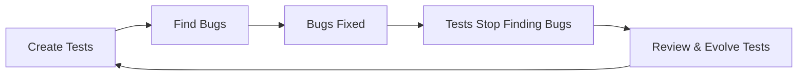
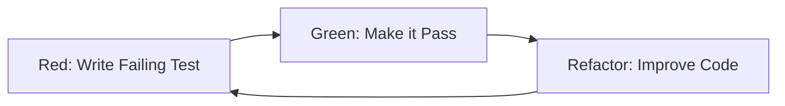

# 🎯 Core Testing Principles & Philosophy

> "The fundamental principles that guide excellence in quality engineering"

## 🏛️ The Seven Pillars of Testing Excellence

### 1. Testing Shows Presence, Not Absence
**Principle:** Testing can show that defects are present, but cannot prove their absence.

**In Practice:**
- Never claim "bug-free" software
- Focus on risk reduction, not elimination
- Continuous testing even after release
- Monitor production for unknown unknowns

**Example Application:**
```markdown
Instead of: "All tests pass, the software is bug-free"
Say: "All identified risks have been validated, critical paths tested, and we have 95% confidence in release readiness"
```

### 2. Exhaustive Testing is Impossible
**Principle:** Testing everything is not feasible except for trivial cases.

**In Practice:**
- Risk-based test prioritization
- Focus on high-impact areas
- Use equivalence partitioning
- Smart test selection

**Risk Priority Matrix:**
```
High Impact + High Probability = Extensive Testing
High Impact + Low Probability = Moderate Testing
Low Impact + High Probability = Basic Testing
Low Impact + Low Probability = Minimal Testing
```

### 3. Early Testing Saves Time and Money
**Principle:** Testing activities should start as early as possible in the SDLC.

**Cost of Defect Detection:**
```
Requirements Phase: $1 to fix
Design Phase: $10 to fix
Development Phase: $100 to fix
Testing Phase: $1,000 to fix
Production: $10,000+ to fix
```

**Implementation:**
- Review requirements for testability
- Participate in design discussions
- Test-Driven Development (TDD)
- Shift-left testing approach

### 4. Defects Cluster Together
**Principle:** A small number of modules typically contain most of the defects.

**Pareto Principle (80/20 Rule):**
- 80% of defects come from 20% of modules
- 80% of crashes from 20% of bugs
- 80% of usage on 20% of features

**Strategic Application:**
```python
def identify_risk_areas():
    risk_factors = {
        'code_complexity': module.cyclomatic_complexity,
        'change_frequency': module.commit_count,
        'past_defects': module.historical_bugs,
        'developer_experience': module.author_experience,
        'code_age': module.last_modified
    }
    return calculate_risk_score(risk_factors)
```

### 5. Pesticide Paradox
**Principle:** Running the same tests repeatedly will eventually stop finding new bugs.

**Prevention Strategies:**
- Regular test review and updates
- Exploratory testing sessions
- Rotate test data
- Chaos engineering
- A/B testing in production

**Test Evolution Cycle:**


### 6. Testing is Context-Dependent
**Principle:** Testing approaches differ based on context and domain.

**Context Considerations:**

| Domain | Focus Area | Testing Approach |
|--------|------------|------------------|
| **Banking** | Security, Accuracy | Extensive validation, compliance testing |
| **Gaming** | Performance, UX | Load testing, playtesting |
| **Medical** | Safety, Reliability | Regulatory testing, fault tolerance |
| **E-commerce** | Availability, Speed | Performance testing, A/B testing |
| **Social Media** | Scale, Engagement | Chaos engineering, user behavior |

### 7. Absence-of-Errors Fallacy
**Principle:** Finding and fixing defects doesn't help if the system doesn't meet user needs.

**Beyond Bug-Free:**
- User satisfaction metrics
- Business value delivery
- Performance benchmarks
- Accessibility standards
- Security compliance

## 🔬 Modern Testing Principles

### Continuous Testing
**Principle:** Testing is an infinite, continuous activity, not a phase.

```yaml
continuous_testing:
  commit:
    - unit_tests
    - lint_checks
  merge:
    - integration_tests
    - security_scan
  deploy:
    - smoke_tests
    - performance_tests
  production:
    - monitoring
    - chaos_experiments
```

### Test Independence
**Principle:** Tests should be independent and idempotent.

**Best Practices:**
```javascript
// Bad: Tests depend on order
test('create user', () => {
  createUser('john@test.com'); // Creates global state
});

test('login user', () => {
  login('john@test.com'); // Depends on previous test
});

// Good: Independent tests
test('login user', () => {
  // Setup
  const user = createTestUser();

  // Test
  const result = login(user.email);

  // Cleanup
  deleteTestUser(user);

  // Assert
  expect(result).toBe(true);
});
```

### Fail Fast
**Principle:** Detect and report failures as quickly as possible.

**Implementation Hierarchy:**
1. Compile-time checks
2. Unit test failures
3. Integration test failures
4. System test failures
5. Production monitoring alerts

## 🧭 Testing Philosophy Frameworks

### The Testing Manifesto

**We Value:**
- **Prevention** over detection
- **Understanding** over documentation
- **Collaboration** over gatekeeping
- **Automation** over manual repetition
- **User value** over requirement compliance

*While there is value in the items on the right, we value the items on the left more.*

### The Quality Mindset

```markdown
## Think Like a...

### 🕵️ Detective
- Investigate anomalies
- Follow evidence trails
- Question everything
- Connect patterns

### 🏗️ Architect
- Design for testability
- Build quality frameworks
- Plan for scale
- Create maintainable systems

### 👤 User
- Experience the product
- Feel the friction
- Expect simplicity
- Demand reliability

### 🔬 Scientist
- Form hypotheses
- Design experiments
- Measure results
- Draw conclusions
```

## 🎨 Testing Design Principles

### FIRST Principles for Unit Tests
- **F**ast: Tests run quickly
- **I**ndependent: Tests don't affect each other
- **R**epeatable: Same result every time
- **S**elf-validating: Clear pass/fail
- **T**imely: Written just in time

### AAA Pattern
```javascript
test('user can login', () => {
  // Arrange
  const user = createUser();
  const credentials = { email: user.email, password: 'password' };

  // Act
  const result = login(credentials);

  // Assert
  expect(result.success).toBe(true);
  expect(result.token).toBeDefined();
});
```

### DRY (Don't Repeat Yourself) in Testing
```javascript
// Shared test utilities
class TestHelpers {
  static createAuthenticatedUser() {
    const user = this.createUser();
    this.login(user);
    return user;
  }

  static setupTestEnvironment() {
    this.clearDatabase();
    this.seedTestData();
    this.mockExternalServices();
  }
}
```

## 🔄 Test-Driven Development (TDD)

### The TDD Cycle


### TDD Benefits
1. **Better Design:** Forces modular, testable code
2. **Living Documentation:** Tests describe behavior
3. **Confidence:** Refactor without fear
4. **Faster Debugging:** Know exactly what broke

### TDD Example
```javascript
// Step 1: Red - Write failing test
test('calculates discount correctly', () => {
  expect(calculateDiscount(100, 0.1)).toBe(90);
});

// Step 2: Green - Minimal implementation
function calculateDiscount(price, discountRate) {
  return price - (price * discountRate);
}

// Step 3: Refactor - Improve implementation
function calculateDiscount(price, discountRate) {
  validatePrice(price);
  validateDiscountRate(discountRate);
  const discount = price * discountRate;
  return Math.round((price - discount) * 100) / 100;
}
```

## 🌟 Behavior-Driven Development (BDD)

### BDD Principles
- Focus on behavior, not implementation
- Use business language
- Collaborate with stakeholders
- Create living documentation

### BDD Structure
```gherkin
Feature: User Authentication
  As a user
  I want to securely log in
  So that I can access my account

  Scenario: Successful login with valid credentials
    Given I am on the login page
    When I enter valid credentials
    And I click the login button
    Then I should be redirected to the dashboard
    And I should see a welcome message

  Scenario: Failed login with invalid password
    Given I am on the login page
    When I enter a valid username
    But I enter an invalid password
    Then I should see an error message
    And I should remain on the login page
```

## 🚀 Shift-Left Testing Principles

### Prevention Over Detection
```markdown
## Cost-Benefit Analysis

### Traditional Testing (Shift-Right)
- Find bug in production: $10,000
- Customer impact: High
- Fix time: Days
- Reputation damage: Possible

### Shift-Left Testing
- Prevent bug in design: $100
- Customer impact: None
- Fix time: Hours
- Reputation damage: None
```

### Shift-Left Activities
1. **Requirements Phase**
   - Testability reviews
   - Acceptance criteria definition
   - Risk assessment

2. **Design Phase**
   - Architecture reviews
   - Test strategy creation
   - Performance planning

3. **Development Phase**
   - Pair programming
   - Code reviews
   - Unit testing

## 🎯 Risk-Based Testing Principles

### Risk Assessment Formula
```
Risk = Probability × Impact

Where:
- Probability: Likelihood of failure (1-10)
- Impact: Business/User impact (1-10)
- Risk Score: 1-100
```

### Risk Mitigation Strategies
| Risk Level | Testing Approach | Coverage Target |
|------------|------------------|-----------------|
| Critical (>75) | Exhaustive testing | 100% |
| High (50-75) | Comprehensive testing | 90% |
| Medium (25-50) | Standard testing | 70% |
| Low (<25) | Basic testing | 50% |

## 🔮 Future-Proof Testing Principles

### AI-Augmented Testing
- Self-healing tests
- Intelligent test selection
- Predictive defect analysis
- Automated test generation

### Chaos Engineering Principles
```yaml
chaos_principles:
  - assume_failure: "Systems will fail"
  - test_production: "Test in realistic conditions"
  - automate_experiments: "Reproducible chaos"
  - minimize_blast_radius: "Controlled experiments"
  - learn_from_failure: "Every incident teaches"
```

## 📚 Learning & Growth Principles

### Continuous Improvement
```markdown
## The Learning Loop

1. **Observe:** Current state analysis
2. **Orient:** Understand context
3. **Decide:** Choose improvement
4. **Act:** Implement change
5. **Measure:** Validate impact
6. **Repeat:** Continuous cycle
```

### Knowledge Sharing
- Document learnings
- Share failure stories
- Mentor others
- Build communities
- Contribute to open source

## 🎖️ The Quality Guardian's Code

```markdown
## I Promise To:

1. **Advocate** for the user at every opportunity
2. **Prevent** defects through proactive involvement
3. **Collaborate** with all stakeholders
4. **Automate** intelligently, not blindly
5. **Learn** continuously from successes and failures
6. **Share** knowledge generously
7. **Measure** what matters, not what's easy
8. **Innovate** in pursuit of excellence
9. **Balance** speed with quality
10. **Deliver** value, not just test results
```

## 🏁 Key Takeaways

### Remember These Truths
1. **Perfect testing is impossible** - Focus on smart testing
2. **Quality is everyone's job** - QA enables it
3. **Prevention beats detection** - Shift left always
4. **Context matters** - No one-size-fits-all
5. **Users define quality** - Not test cases
6. **Continuous improvement** - Never stop evolving
7. **Data drives decisions** - Measure and adjust

---

*"Quality is not an act, it is a habit. These principles guide us toward that habit."*