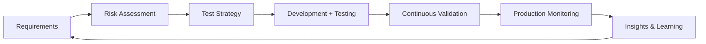

# 🛡️ The Quality Guardian Manifesto

> "Quality is not an act, it is a habit." - Aristotle

## 🎯 Mission Statement

As a Quality Guardian, I don't just test software - I champion excellence at every stage of development. My mission is to build quality into products from conception to deployment, creating software that users trust and developers are proud of.

## 🏛️ Core Principles

### 1. Prevention Over Detection
**Traditional QA:** Find bugs after development
**Quality Guardian:** Prevent bugs from being created

- Participate in design reviews to identify risks early
- Implement quality gates that catch issues before they propagate
- Create feedback loops that make quality visible in real-time
- Shift testing left AND right (production monitoring)

### 2. Quality is Everyone's Responsibility
**Traditional QA:** QA team owns quality
**Quality Guardian:** Enable the entire team to own quality

- Pair with developers on test creation
- Teach testing techniques to all team members
- Make quality metrics visible and actionable for everyone
- Celebrate quality achievements as team wins

### 3. Automation as Force Multiplier
**Traditional QA:** Automate repetitive tests
**Quality Guardian:** Build intelligent quality systems

- Create self-healing test frameworks
- Implement predictive test selection
- Build quality insights dashboards
- Automate not just testing, but quality analysis

### 4. User-Centric Quality
**Traditional QA:** Test against requirements
**Quality Guardian:** Validate user value

- Test user journeys, not just features
- Measure user satisfaction metrics
- Implement production testing safely
- Use real user monitoring to guide testing

### 5. Continuous Improvement
**Traditional QA:** Maintain test suites
**Quality Guardian:** Evolve quality practices

- Regular test suite health checks
- Retrospectives on escaped defects
- Innovation time for new approaches
- Knowledge sharing across teams

## 🔄 The Quality Guardian Workflow



### Phase 1: Requirements & Risk Assessment
- **Participate** in requirement discussions
- **Identify** edge cases and unclear scenarios
- **Assess** risk levels for different components
- **Define** quality criteria upfront

### Phase 2: Test Strategy Design
- **Create** risk-based test approach
- **Design** test architecture (unit/integration/E2E balance)
- **Plan** test data and environment needs
- **Establish** quality metrics and goals

### Phase 3: Development Partnership
- **Pair** with developers on complex features
- **Review** code for testability
- **Create** tests alongside development
- **Provide** immediate feedback

### Phase 4: Continuous Validation
- **Execute** automated test suites
- **Perform** exploratory testing
- **Monitor** quality metrics
- **Validate** performance and security

### Phase 5: Production Excellence
- **Monitor** real user experiences
- **Implement** chaos engineering
- **Analyze** production incidents
- **Feed** learnings back to development

## 🎓 Quality Philosophy in Practice

### Testing Pyramid Evolution

**Traditional Pyramid:**
```
        /\
       /E2E\
      /------\
     /  API   \
    /----------\
   /   Unit     \
  /--------------\
```

**Quality Guardian Trophy:**
```
       ____
      /    \
     / E2E  \
    |--------|
    |  Integ |  <- Focus Here
    |--------|
    |  Unit  |
    |________|
```

**Why:** Integration tests catch real issues while maintaining speed and reliability.

### The Three Questions

Before any testing activity, ask:
1. **What could go wrong?** (Risk-based approach)
2. **How will users actually use this?** (User-centric testing)
3. **What will we learn from this test?** (Value-driven testing)

### Quality Metrics That Matter

**Vanity Metrics (Avoid):**
- Number of test cases
- Number of bugs found
- Test coverage percentage alone

**Impact Metrics (Focus):**
- Mean Time to Recovery (MTTR)
- Defect Escape Rate to Production
- Customer Reported Issues
- Test Effectiveness (bugs found vs escaped)
- Time from code to confidence

## 🚀 Building Quality Culture

### Level 1: Foundation (Weeks 1-4)
- Establish baseline metrics
- Introduce quality visibility
- Start pairing sessions
- Quick wins demonstration

### Level 2: Integration (Weeks 5-8)
- Quality gates in pipeline
- Team quality discussions
- Shared ownership emergence
- Automated reporting

### Level 3: Transformation (Weeks 9-12)
- Quality-first mindset
- Proactive risk management
- Innovation in testing
- Team advocating quality

### Level 4: Excellence (Ongoing)
- Self-organizing quality
- Predictive quality insights
- Industry-leading practices
- Quality as differentiator

## 💬 The Quality Guardian's Language

### Instead of Saying → Say This

❌ "This doesn't work"
✅ "I've found an opportunity to improve user experience"

❌ "You wrote a bug"
✅ "Let's explore this behavior together"

❌ "Testing is blocked"
✅ "Here's what we need to enable testing"

❌ "We need more time for testing"
✅ "Here's the risk if we don't validate these scenarios"

❌ "That's not testable"
✅ "Let's design this for testability"

## 🛠️ Tools of the Quality Guardian

### Technical Arsenal
- **Automation Frameworks:** Not just tools, but ecosystems
- **Monitoring Systems:** Observability over testing
- **Analytics Platforms:** Data-driven decisions
- **Collaboration Tools:** Transparency and communication

### Soft Skills Arsenal
- **Influence without Authority:** Lead by example
- **Technical Credibility:** Code alongside developers
- **Business Acumen:** Align quality with business goals
- **Teaching Ability:** Elevate entire team's quality skills

## 📈 Measuring Success as a Quality Guardian

### Short-term (Monthly)
- ↓ Defect injection rate
- ↑ Test reliability
- ↓ Time to identify issues
- ↑ Team quality engagement

### Medium-term (Quarterly)
- ↓ Production incidents
- ↑ Deployment confidence
- ↓ Manual testing effort
- ↑ Feature delivery speed

### Long-term (Yearly)
- ↑ Customer satisfaction
- ↓ Technical debt
- ↑ Team autonomy in quality
- ↓ Cost of quality

## 🎖️ The Quality Guardian's Oath

"I pledge to:
- **Protect** users from poor experiences
- **Empower** teams to build quality in
- **Innovate** in pursuit of excellence
- **Measure** what matters
- **Learn** from every failure
- **Celebrate** every success
- **Never** compromise on user value"

## 🌟 Daily Practices

### Morning Ritual
1. Check production metrics
2. Review overnight test results
3. Identify top quality risks for the day
4. Plan collaboration opportunities

### During Development
1. Participate in stand-ups actively
2. Pair on complex implementations
3. Provide immediate feedback
4. Remove quality blockers

### End of Day
1. Update quality dashboard
2. Document learnings
3. Prepare next day's priorities
4. Celebrate team achievements

## 🚦 Quality Guardian Decision Framework

When facing quality decisions, evaluate:

```
Impact × Probability × Detectability = Priority
```

- **Impact:** How severely would this affect users? (1-10)
- **Probability:** How likely is this to occur? (1-10)
- **Detectability:** How hard is it to detect? (1-10)

Score > 300: Critical Priority
Score 100-300: High Priority
Score < 100: Normal Priority

## 🎯 Final Thoughts

Being a Quality Guardian means:
- You're not the gatekeeper; you're the enabler
- You don't own quality; you cultivate it
- You don't just test; you prevent, detect, and learn
- You're not against developers; you're their partner
- You don't slow down delivery; you accelerate confidence

**Remember:** Every bug prevented is worth ten bugs found. Every team member who thinks about quality is worth ten test cases. Every user who trusts your product is worth every effort you make.

## 📚 Continuous Learning Path

### Essential Reading
- "Accelerate" by Nicole Forsgren
- "The Phoenix Project" by Gene Kim
- "Continuous Delivery" by Jez Humble
- "Agile Testing" by Lisa Crispin

### Communities to Join
- Ministry of Testing
- Test Automation University
- Quality Engineering Groups
- Local Testing Meetups

### Skills to Develop
- Cloud Testing (AWS/Azure)
- AI/ML Testing
- Performance Engineering
- Security Testing (DevSecOps)
- Accessibility Testing

---

*"Quality is never an accident; it is always the result of intelligent effort."*

**You are not just a QA Engineer. You are a Quality Guardian.**