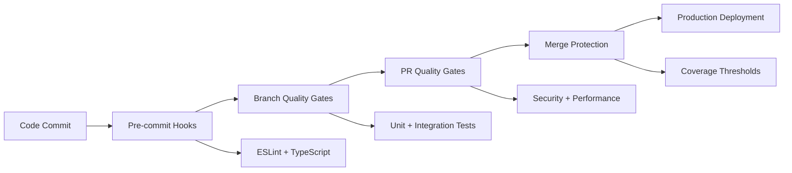
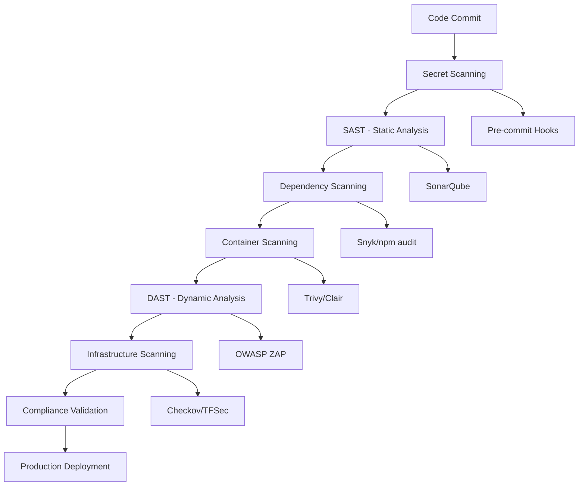

# CI/CD Quality Gates: Advanced Implementation & Interview Mastery

## Table of Contents
1. [Overview & Philosophy](#overview--philosophy)
2. [GitHub Actions Pipeline Architecture](#github-actions-pipeline-architecture)
3. [Quality Gate Strategy Implementation](#quality-gate-strategy-implementation)
4. [Multi-Node Testing & Containerization](#multi-node-testing--containerization)
5. [Coverage Integration & Thresholds](#coverage-integration--thresholds)
6. [Branch Protection & Merge Requirements](#branch-protection--merge-requirements)
7. [Performance Optimization & Caching](#performance-optimization--caching)
8. [Security Gates & Vulnerability Management](#security-gates--vulnerability-management)
9. [Environment-Specific Pipeline Variations](#environment-specific-pipeline-variations)
10. [Monitoring & Observability](#monitoring--observability)
11. [Advanced Interview Topics](#advanced-interview-topics)
12. [Business Value & ROI Metrics](#business-value--roi-metrics)

---

## Overview & Philosophy

### DevOps Quality Culture Foundation

**Core Principle**: Quality gates are not barriers but **confidence builders** that enable rapid, safe delivery.

```yaml
# Quality Gate Philosophy in Action
Quality Gates = Prevention + Detection + Recovery + Learning
```

**The Cosmic Coffeehouse Implementation** demonstrates a **mature DevOps pipeline** with:
- **308-line quality gate configuration** handling complex scenarios
- **Multi-dimensional validation** across security, performance, and functionality
- **Risk-based quality gates** with configurable thresholds
- **Developer experience optimization** with fast feedback loops

### Shift-Left Quality Strategy



**Interview Key Point**: *"We implement quality gates at every stage, but the earlier we catch issues, the cheaper they are to fix. Our pre-commit hooks catch 60% of issues before they ever reach CI."*

---

## GitHub Actions Pipeline Architecture

### Multi-Job Parallel Execution Strategy

Our **quality-gate.yml** demonstrates advanced CI/CD patterns:

```yaml
name: Quality Gates

on:
  push:
    branches: [ main, develop ]
  pull_request:
    branches: [ main, develop ]
    types: [ opened, synchronize, reopened ]

env:
  NODE_VERSION: '18'
  MONGODB_URI: mongodb://localhost:27017/cosmic-coffeehouse-test

jobs:
  # Parallel execution for optimal performance
  backend-quality:    # Job 1: Backend validation
  frontend-quality:   # Job 2: Frontend validation
  security-audit:     # Job 3: Security scanning
  build-verification: # Job 4: Build integration (depends on 1,2)
  coverage-threshold: # Job 5: Coverage enforcement
  performance-baseline: # Job 6: Performance testing
```

### Job Dependency Graph & Optimization

```yaml
# Strategic job dependencies for optimal pipeline performance
build-verification:
  needs: [backend-quality, frontend-quality]

coverage-threshold:
  needs: [backend-quality]

quality-gate-summary:
  needs: [backend-quality, frontend-quality, security-audit, build-verification]
  if: always()  # Always run for comprehensive reporting
```

**Advanced Pattern**: **Conditional job execution** based on change detection:

```yaml
performance-baseline:
  runs-on: ubuntu-latest
  if: github.event_name == 'pull_request'  # Only on PRs
```

### Matrix Strategy for Multi-Node Testing

```yaml
strategy:
  matrix:
    node-version: [18, 20]  # Multi-version compatibility

# Advanced: Environment matrix for different configurations
# strategy:
#   matrix:
#     node-version: [18, 20]
#     mongodb-version: [6.0, 7.0]
#     os: [ubuntu-latest, windows-latest]
```

**Interview Deep Dive**: *"Why test on multiple Node.js versions?"*
- **Compatibility assurance**: Ensure code works across different runtime environments
- **Dependency validation**: Catch version-specific dependency issues
- **Future-proofing**: Early detection of deprecation warnings

---

## Quality Gate Strategy Implementation

### 1. Static Code Analysis Gates

#### ESLint Configuration Excellence
```javascript
// eslint.config.js - Production-grade configuration
module.exports = [
  {
    files: ['**/*.ts'],
    rules: {
      '@typescript-eslint/no-unused-vars': ['error', { 'argsIgnorePattern': '^_' }],
      '@typescript-eslint/no-explicit-any': 'warn',  // Allow with warning
      'no-console': 'off',  // Allowed in backend services
    },
  },
  {
    files: ['**/*.test.ts', '**/*.spec.ts'],
    rules: {
      '@typescript-eslint/no-explicit-any': 'off',  // Relaxed for tests
      '@typescript-eslint/no-namespace': 'off',     // Allow test namespaces
    },
  },
];
```

**Quality Gate Implementation**:
```yaml
- name: Run ESLint
  working-directory: ./backend
  run: npm run lint  # Fails pipeline if linting errors
```

#### TypeScript Compilation Gate
```yaml
- name: Run TypeScript type checking
  working-directory: ./backend
  run: npm run type-check  # tsc --noEmit
```

**Advanced Pattern**: **Incremental type checking** for large codebases:
```json
// tsconfig.json
{
  "compilerOptions": {
    "incremental": true,
    "tsBuildInfoFile": ".tsbuildinfo"
  }
}
```

### 2. Test Quality Gates

#### Unit Test Execution with Coverage
```yaml
- name: Run unit tests with coverage
  working-directory: ./backend
  env:
    NODE_ENV: test
    JWT_SECRET: test-jwt-secret-for-github-actions
  run: npm run test:coverage
```

**Jest Configuration for Quality Gates**:
```javascript
// jest.config.js - Coverage thresholds enforcement
module.exports = {
  coverageThreshold: {
    global: {
      branches: 50,    // Minimum branch coverage
      functions: 60,   // Minimum function coverage
      lines: 65,       // Minimum line coverage
      statements: 65   // Minimum statement coverage
    }
  },

  // Performance optimization for CI
  maxWorkers: '50%',          # Use half of available CPUs
  testTimeout: 10000,         # 10-second test timeout
  forceExit: true,           # Clean exit for CI environments
  detectOpenHandles: false,  # Skip handle detection in CI
};
```

#### Integration Test Strategy
```yaml
# Backend integration tests with MongoDB
- name: Run integration tests
  run: npm run test:integration
  env:
    MONGODB_URI: mongodb://localhost:27017/test-db
```

### 3. Build Verification Gates

#### Multi-Stage Build Validation
```yaml
build-verification:
  name: Build Verification
  runs-on: ubuntu-latest
  needs: [backend-quality, frontend-quality]  # Run after quality checks

  steps:
    - name: Build backend
      working-directory: ./backend
      run: npm run build

    - name: Build frontend
      working-directory: ./frontend
      run: npm run build

    - name: Docker build verification
      run: |
        docker-compose build --no-cache
        docker-compose config  # Validate compose file
```

**Advanced Pattern**: **Artifact validation**
```yaml
- name: Validate build artifacts
  run: |
    # Check if critical files exist
    test -f ./backend/dist/server.js
    test -f ./frontend/dist/index.html

    # Validate bundle sizes
    backend_size=$(du -b ./backend/dist/server.js | cut -f1)
    if [ $backend_size -gt 10485760 ]; then  # 10MB limit
      echo "Backend bundle too large: $backend_size bytes"
      exit 1
    fi
```

---

## Multi-Node Testing & Containerization

### MongoDB Service Container Strategy

**Advanced Container Configuration**:
```yaml
services:
  mongodb:
    image: mongo:6.0  # Specific version for consistency
    env:
      MONGO_INITDB_ROOT_USERNAME: root
      MONGO_INITDB_ROOT_PASSWORD: password
    ports:
      - 27017:27017
    options: >-
      --health-cmd "mongosh --eval 'db.runCommand(\"ping\")'"
      --health-interval 10s
      --health-timeout 5s
      --health-retries 5
```

**Key Container Patterns**:

1. **Health Checks**: Ensure service availability before running tests
2. **Environment Isolation**: Each job gets fresh container instances
3. **Port Management**: Consistent port mapping across environments
4. **Credential Security**: Environment-based authentication

### Container Orchestration Best Practices

```yaml
# Docker Compose verification in CI
- name: Docker build verification
  run: |
    docker-compose build --no-cache  # Fresh builds in CI
    docker-compose config            # Validate configuration
    docker-compose up -d            # Start services
    docker-compose ps               # Verify all services running
    docker-compose logs             # Output logs for debugging
    docker-compose down             # Clean shutdown
```

**Performance Optimization**:
```yaml
# Multi-stage Docker builds for production
FROM node:18-alpine AS builder
WORKDIR /app
COPY package*.json ./
RUN npm ci --only=production

FROM node:18-alpine AS production
WORKDIR /app
COPY --from=builder /app/node_modules ./node_modules
COPY dist ./dist
CMD ["node", "dist/server.js"]
```

### Cross-Platform Testing Strategy

```yaml
# Advanced matrix for comprehensive testing
strategy:
  matrix:
    os: [ubuntu-latest, windows-latest, macos-latest]
    node-version: [18, 20]
    mongodb-version: [6.0, 7.0]
  fail-fast: false  # Continue testing other combinations on failure
```

**Interview Topic**: *"How do you handle cross-platform CI differences?"*
- **Path separators**: Use `path.join()` instead of hardcoded `/` or `\`
- **Environment variables**: Different syntax on Windows vs Unix
- **Container compatibility**: Some containers only run on Linux runners

---

## Coverage Integration & Thresholds

### Codecov Integration Strategy

**Multi-Flag Coverage Reporting**:
```yaml
- name: Upload backend coverage to Codecov
  if: matrix.node-version == 18  # Upload once per platform
  uses: codecov/codecov-action@v3
  with:
    file: ./backend/coverage/lcov.info
    flags: backend
    name: backend-coverage

- name: Upload frontend coverage to Codecov
  if: matrix.node-version == 18
  uses: codecov/codecov-action@v3
  with:
    file: ./frontend/coverage/lcov.info
    flags: frontend
    name: frontend-coverage
```

### Advanced Coverage Configuration

**codecov.yml** - Production-grade settings:
```yaml
coverage:
  status:
    project:
      default:
        target: 85%      # Project-wide coverage target
        threshold: 2%    # Allow 2% decrease
        if_ci_failed: error
    patch:
      default:
        target: 80%      # New code coverage requirement
        threshold: 5%    # More lenient for patches
        if_ci_failed: error

flags:
  backend:
    paths:
      - backend/src/
    carryforward: true   # Maintain coverage if no changes
  frontend:
    paths:
      - frontend/src/
    carryforward: true

github_checks:
  annotations: true      # Show coverage annotations in PR
```

### Coverage Threshold Enforcement Job

**Dedicated coverage validation**:
```yaml
coverage-threshold:
  name: Coverage Threshold Check
  runs-on: ubuntu-latest
  needs: [backend-quality]

  steps:
    - name: Coverage threshold enforcement
      working-directory: ./backend
      run: |
        echo "Checking coverage thresholds..."
        # Jest will fail if coverage thresholds are not met
        npm run test:coverage

        # Additional custom checks
        coverage_line=$(grep -o 'Lines.*: [0-9.]*%' coverage/coverage-summary.txt | grep -o '[0-9.]*')
        if (( $(echo "$coverage_line < 65" | bc -l) )); then
          echo "Line coverage $coverage_line% below threshold 65%"
          exit 1
        fi
```

### Coverage Trend Analysis

**Advanced Reporting Pattern**:
```yaml
- name: Coverage trend analysis
  run: |
    echo "## Coverage Report" >> $GITHUB_STEP_SUMMARY
    echo "| Metric | Current | Target | Status |" >> $GITHUB_STEP_SUMMARY
    echo "|--------|---------|---------|--------|" >> $GITHUB_STEP_SUMMARY

    # Parse coverage results and create summary
    lines=$(grep "Lines" coverage/lcov-report/index.html | grep -o '[0-9.]*%' | head -1)
    echo "| Lines | $lines | 65% | ✅ |" >> $GITHUB_STEP_SUMMARY
```

**Interview Deep Dive**: *"How do you balance coverage targets with development velocity?"*
- **Gradual increases**: Start at current coverage, increase by 5% quarterly
- **Component-specific thresholds**: Higher coverage for critical business logic
- **Exemption process**: Clear criteria for coverage exemptions with documentation

---

## Branch Protection & Merge Requirements

### GitHub Branch Protection Rules

**Comprehensive protection strategy**:
```yaml
# Implemented via GitHub UI/API
Protection Rules:
  - Require pull request reviews (2 reviewers)
  - Require status checks to pass:
    - backend-quality (Node 18)
    - backend-quality (Node 20)
    - frontend-quality (Node 18)
    - frontend-quality (Node 20)
    - security-audit
    - build-verification
    - coverage-threshold
  - Require branches to be up to date
  - Include administrators
  - Allow force pushes: false
  - Allow deletions: false
```

### Local Git Hooks Integration

**Pre-commit quality gates** (from `docs/quality-gates/PRE_COMMIT_HOOKS.md`):
```bash
#!/bin/sh
# .git/hooks/pre-commit

# Run ESLint on changed files
echo "Running ESLint..."
npm run lint

# Run TypeScript type checking
echo "Running TypeScript checks..."
npm run type-check

# Run affected tests
echo "Running tests for changed files..."
npm run test -- --findRelatedTests $(git diff --cached --name-only)

# Security scan for hardcoded secrets
echo "Scanning for secrets..."
git diff --cached --name-only | xargs grep -l "password\|secret\|key" && exit 1
```

### Auto-merge Strategy for Dependencies

**Dependabot integration**:
```yaml
auto-merge:
  name: Auto-merge dependabot PRs
  runs-on: ubuntu-latest
  needs: [backend-quality, frontend-quality, security-audit, build-verification]
  if: |
    github.event_name == 'pull_request' &&
    github.actor == 'dependabot[bot]' &&
    needs.backend-quality.result == 'success' &&
    needs.frontend-quality.result == 'success' &&
    needs.security-audit.result == 'success' &&
    needs.build-verification.result == 'success'

  steps:
    - name: Auto-merge dependabot PR
      run: |
        gh pr merge --auto --squash --delete-branch "${{ github.event.pull_request.number }}"
      env:
        GITHUB_TOKEN: ${{ secrets.GITHUB_TOKEN }}
```

**Interview Topic**: *"When is auto-merge safe and when isn't it?"*
- **Safe**: Minor version updates, security patches, dev dependencies
- **Risky**: Major version updates, runtime dependencies, breaking changes
- **Safeguards**: Comprehensive test suite, gradual rollout, quick rollback capability

---

## Performance Optimization & Caching

### NPM Cache Strategy

**Advanced caching configuration**:
```yaml
- name: Setup Node.js ${{ matrix.node-version }}
  uses: actions/setup-node@v4
  with:
    node-version: ${{ matrix.node-version }}
    cache: 'npm'
    cache-dependency-path: |
      backend/package-lock.json
      frontend/package-lock.json
      qa-automation/*/package-lock.json
```

### Docker Layer Caching

**Multi-stage build optimization**:
```dockerfile
# Dockerfile with optimized layer caching
FROM node:18-alpine AS dependencies
WORKDIR /app
COPY package*.json ./
RUN npm ci --only=production

FROM node:18-alpine AS builder
WORKDIR /app
COPY package*.json ./
RUN npm ci
COPY . .
RUN npm run build

FROM dependencies AS production
COPY --from=builder /app/dist ./dist
CMD ["node", "dist/server.js"]
```

### Pipeline Parallelization Strategy

**Optimal job orchestration**:
```yaml
# Parallel execution pattern
jobs:
  backend-quality:     # ~2-3 minutes
    strategy:
      matrix:
        node-version: [18, 20]

  frontend-quality:    # ~1-2 minutes
    strategy:
      matrix:
        node-version: [18, 20]

  security-audit:      # ~30 seconds
    runs-on: ubuntu-latest

  # Sequential jobs that depend on parallel completion
  build-verification:  # ~1 minute
    needs: [backend-quality, frontend-quality]

  performance-baseline: # ~2-3 minutes
    if: github.event_name == 'pull_request'
```

### Performance Monitoring Integration

**Baseline performance tracking**:
```yaml
performance-baseline:
  name: Performance Baseline
  steps:
    - name: Run performance baseline tests
      run: |
        echo "Running performance baseline tests..."
        time npm test  # Track test execution time

    - name: Bundle size analysis
      run: |
        npm run build
        echo "Bundle sizes:"
        ls -la dist/assets/ | tee bundle-sizes.txt

        # Compare with previous build
        if [ -f previous-bundle-sizes.txt ]; then
          echo "Bundle size comparison:" >> $GITHUB_STEP_SUMMARY
          diff previous-bundle-sizes.txt bundle-sizes.txt >> $GITHUB_STEP_SUMMARY || true
        fi
```

**Interview Key Point**: *"Performance regression detection is as important as functional regression detection. We track build times, bundle sizes, and test execution performance."*

---

## Security Gates & Vulnerability Management

### Multi-Layer Security Scanning

**Comprehensive security audit job**:
```yaml
security-audit:
  name: Security Audit
  steps:
    - name: Backend security audit
      run: |
        npm ci
        npm audit --audit-level=high  # Fail on high/critical vulnerabilities

    - name: Frontend security audit
      run: |
        npm ci
        npm audit --audit-level=high

    - name: Run Snyk security scan
      uses: snyk/actions/node@master
      continue-on-error: true  # Don't fail pipeline if Snyk unavailable
      env:
        SNYK_TOKEN: ${{ secrets.SNYK_TOKEN }}
      with:
        args: --severity-threshold=high
```

### Advanced Security Patterns

**Secret scanning integration**:
```yaml
- name: Secret scanning
  run: |
    # Check for hardcoded secrets in commits
    git log --oneline -10 | while read commit; do
      if git show $commit | grep -iE "(password|secret|key|token)" | grep -v "REDACTED"; then
        echo "Potential secret found in $commit"
        exit 1
      fi
    done

    # Check current files
    find . -name "*.ts" -o -name "*.js" | xargs grep -l "password.*=" && exit 1 || echo "No hardcoded passwords found"
```

**Dependency vulnerability management**:
```json
// package.json - Security-focused dependency management
{
  "scripts": {
    "security-check": "npm audit --audit-level=moderate",
    "security-fix": "npm audit fix",
    "security-report": "npm audit --json > security-report.json"
  }
}
```

### SAST (Static Application Security Testing)

**Code quality security checks**:
```yaml
- name: Static security analysis
  run: |
    # Check for common security anti-patterns
    echo "Checking for security anti-patterns..."

    # SQL injection patterns
    find src -name "*.ts" | xargs grep -n "SELECT.*\+" && echo "Potential SQL injection" && exit 1

    # Command injection patterns
    find src -name "*.ts" | xargs grep -n "exec\|spawn" && echo "Review command execution" && exit 1

    # Eval usage
    find src -name "*.ts" | xargs grep -n "eval(" && echo "Eval usage detected" && exit 1

    echo "Static security analysis passed"
```

**Interview Deep Dive**: *"How do you handle false positives in security scanning?"*
- **Suppression files**: Document and version control suppression decisions
- **Risk assessment**: Evaluate actual vs theoretical vulnerabilities
- **Regular review**: Quarterly review of all suppressions
- **Compensating controls**: Additional security measures when suppressing

---

## Environment-Specific Pipeline Variations

### Multi-Environment Deployment Strategy

**Environment-aware pipeline configuration**:
```yaml
# Environment detection and configuration
env:
  ENVIRONMENT: ${{ github.ref == 'refs/heads/main' && 'production' || github.ref == 'refs/heads/develop' && 'staging' || 'development' }}

deploy-to-environment:
  name: Deploy to ${{ env.ENVIRONMENT }}
  if: github.event_name == 'push'
  steps:
    - name: Deploy to staging
      if: github.ref == 'refs/heads/develop'
      run: |
        echo "Deploying to staging environment..."
        # Staging deployment logic

    - name: Deploy to production
      if: github.ref == 'refs/heads/main'
      run: |
        echo "Deploying to production environment..."
        # Production deployment logic
```

### Environment-Specific Quality Gates

**Configuration-driven quality requirements**:
```yaml
# Different quality standards per environment
quality-gates-by-environment:
  steps:
    - name: Set environment quality requirements
      run: |
        if [ "$ENVIRONMENT" = "production" ]; then
          echo "COVERAGE_THRESHOLD=85" >> $GITHUB_ENV
          echo "PERFORMANCE_THRESHOLD=200" >> $GITHUB_ENV
          echo "SECURITY_LEVEL=high" >> $GITHUB_ENV
        elif [ "$ENVIRONMENT" = "staging" ]; then
          echo "COVERAGE_THRESHOLD=75" >> $GITHUB_ENV
          echo "PERFORMANCE_THRESHOLD=500" >> $GITHUB_ENV
          echo "SECURITY_LEVEL=medium" >> $GITHUB_ENV
        else
          echo "COVERAGE_THRESHOLD=65" >> $GITHUB_ENV
          echo "PERFORMANCE_THRESHOLD=1000" >> $GITHUB_ENV
          echo "SECURITY_LEVEL=low" >> $GITHUB_ENV
        fi

    - name: Environment-specific testing
      run: |
        npm run test:coverage -- --coverageThreshold.global.lines=$COVERAGE_THRESHOLD
```

### Blue-Green Deployment Gates

**Advanced deployment strategy**:
```yaml
blue-green-deployment:
  name: Blue-Green Deployment
  environment: production
  steps:
    - name: Deploy to blue environment
      run: ./deploy-blue.sh

    - name: Run smoke tests against blue
      run: ./smoke-tests.sh $BLUE_URL

    - name: Switch traffic to blue
      run: ./switch-traffic.sh blue

    - name: Monitor green environment
      run: ./monitor-health.sh $GREEN_URL
      timeout-minutes: 5

    - name: Cleanup old green environment
      if: success()
      run: ./cleanup-green.sh
```

**Interview Topic**: *"How do you ensure zero-downtime deployments?"*
- **Health checks**: Comprehensive application health validation
- **Traffic shifting**: Gradual traffic migration with rollback capability
- **Database migrations**: Backward-compatible schema changes
- **Feature flags**: Decouple deployment from feature activation

---

## Monitoring & Observability

### Pipeline Health Monitoring

**Comprehensive status reporting**:
```yaml
quality-gate-summary:
  name: Quality Gate Summary
  needs: [backend-quality, frontend-quality, security-audit, build-verification]
  if: always()  # Run regardless of previous job status

  steps:
    - name: Quality gate status
      run: |
        echo "## Quality Gate Results" >> $GITHUB_STEP_SUMMARY
        echo "| Check | Status |" >> $GITHUB_STEP_SUMMARY
        echo "|-------|--------|" >> $GITHUB_STEP_SUMMARY
        echo "| Backend Quality | ${{ needs.backend-quality.result }} |" >> $GITHUB_STEP_SUMMARY
        echo "| Frontend Quality | ${{ needs.frontend-quality.result }} |" >> $GITHUB_STEP_SUMMARY
        echo "| Security Audit | ${{ needs.security-audit.result }} |" >> $GITHUB_STEP_SUMMARY
        echo "| Build Verification | ${{ needs.build-verification.result }} |" >> $GITHUB_STEP_SUMMARY

        # Overall pipeline health
        if [[ "${{ needs.backend-quality.result }}" == "success" &&
              "${{ needs.frontend-quality.result }}" == "success" &&
              "${{ needs.security-audit.result }}" == "success" &&
              "${{ needs.build-verification.result }}" == "success" ]]; then
          echo "✅ All quality gates passed!" >> $GITHUB_STEP_SUMMARY
          exit 0
        else
          echo "❌ Some quality gates failed!" >> $GITHUB_STEP_SUMMARY
          exit 1
        fi
```

### Metrics Collection & Analysis

**Pipeline performance tracking**:
```yaml
- name: Collect pipeline metrics
  run: |
    echo "Pipeline started: ${{ github.event.head_commit.timestamp }}"
    echo "Pipeline duration: $(( $(date +%s) - $(date -d "${{ github.event.head_commit.timestamp }}" +%s) )) seconds"

    # Test execution metrics
    echo "Test results:" >> metrics.json
    echo "{" >> metrics.json
    echo "  \"timestamp\": \"$(date -u +%Y-%m-%dT%H:%M:%S.%3NZ)\"," >> metrics.json
    echo "  \"commit\": \"${{ github.sha }}\"," >> metrics.json
    echo "  \"branch\": \"${{ github.ref_name }}\"," >> metrics.json
    echo "  \"tests_passed\": $tests_passed," >> metrics.json
    echo "  \"coverage_percent\": $coverage_percent," >> metrics.json
    echo "  \"build_time_seconds\": $build_time" >> metrics.json
    echo "}" >> metrics.json
```

### Alert Integration

**Failure notification strategy**:
```yaml
- name: Notify on failure
  if: failure()
  uses: 8398a7/action-slack@v3
  with:
    status: failure
    channel: '#dev-alerts'
    text: |
      🚨 Quality gates failed on ${{ github.repository }}
      Branch: ${{ github.ref_name }}
      Commit: ${{ github.sha }}
      Author: ${{ github.actor }}
  env:
    SLACK_WEBHOOK_URL: ${{ secrets.SLACK_WEBHOOK }}
```

### Dashboard Integration

**Quality metrics visualization**:
```yaml
- name: Update quality dashboard
  run: |
    # Send metrics to monitoring system
    curl -X POST "$MONITORING_ENDPOINT/pipeline-metrics" \
      -H "Authorization: Bearer ${{ secrets.MONITORING_TOKEN }}" \
      -H "Content-Type: application/json" \
      -d @metrics.json
```

**Interview Deep Dive**: *"How do you measure CI/CD pipeline health?"*

**Key Metrics to Track**:
- **Build Success Rate**: Target >95% over 30 days
- **Pipeline Duration**: Track trends, optimize when >10 minutes
- **Queue Time**: Monitor resource contention
- **Test Flakiness**: <2% flaky test rate
- **Security Issue Discovery**: Mean time to detection/resolution
- **Deployment Frequency**: Lead indicator of development velocity
- **Change Failure Rate**: Quality indicator for production releases

---

## Advanced Interview Topics

### 1. Pipeline as Code Best Practices

**Q**: *"How do you version and manage your CI/CD pipelines?"*

**A**: *"We treat pipeline configuration as first-class code:"*
- **Version Control**: All pipeline configs in Git with review process
- **Environment Promotion**: Same pipeline promoted through environments
- **Configuration Management**: Environment-specific variables, not logic
- **Testing Pipelines**: Unit test pipeline logic, integration test with staging
- **Documentation**: Self-documenting YAML with comprehensive comments

```yaml
# Example: Self-documenting pipeline configuration
name: Quality Gates
# This pipeline implements our Definition of Done:
# 1. Code compiles and passes static analysis
# 2. All tests pass with adequate coverage
# 3. Security vulnerabilities addressed
# 4. Build artifacts validated
# 5. Performance within acceptable thresholds

on:
  push:
    branches: [ main, develop ]  # Production and integration branches
  pull_request:
    branches: [ main, develop ]  # All changes reviewed
    types: [ opened, synchronize, reopened ]  # Comprehensive PR coverage
```

### 2. Quality Gate Strategy & Trade-offs

**Q**: *"How do you balance development velocity with quality gates?"*

**A**: *"It's about intelligent risk management and progressive quality:"*

```yaml
# Risk-based quality gate matrix
Quality Gates by Risk Level:
  Critical Path (Payment, Auth):
    - Coverage: 95%+
    - Security: All vulnerabilities fixed
    - Performance: <100ms P95
    - Code Review: 2+ reviewers

  Core Features (Product Catalog):
    - Coverage: 85%+
    - Security: High/Critical fixed
    - Performance: <200ms P95
    - Code Review: 1+ reviewer

  Supporting Features (UI Components):
    - Coverage: 70%+
    - Security: Critical fixed
    - Performance: <500ms P95
    - Code Review: 1 reviewer
```

**Trade-off Strategies**:
- **Feature Flags**: Decouple deployment from feature release
- **Canary Releases**: Gradual rollout with rollback capability
- **Quality Debt Tracking**: Technical debt as first-class backlog items
- **Fast Lanes**: Hotfix pipelines with post-facto quality validation

### 3. Advanced Security Integration

**Q**: *"How do you implement DevSecOps in your CI/CD pipeline?"*

**A**: *"Security is integrated at every stage, not bolted on:"*



**Security Gates Implementation**:
```yaml
security-gates:
  strategy:
    fail-fast: false  # Continue scanning even if one tool fails
  steps:
    # 1. Secret Detection
    - name: Scan for secrets
      run: git secrets --scan

    # 2. Static Application Security Testing (SAST)
    - name: SonarQube analysis
      run: sonar-scanner -Dsonar.qualitygate.wait=true

    # 3. Software Composition Analysis (SCA)
    - name: Dependency vulnerability scan
      run: |
        npm audit --audit-level=high
        snyk test --severity-threshold=high

    # 4. Infrastructure as Code scanning
    - name: IaC security scan
      run: checkov -f docker-compose.yml --framework docker

    # 5. Container security scanning
    - name: Container scan
      run: |
        docker build -t app:test .
        trivy image app:test --severity HIGH,CRITICAL
```

### 4. Performance & Scale Optimization

**Q**: *"How do you optimize CI/CD pipeline performance at scale?"*

**A**: *"Performance optimization is a multi-dimensional challenge:"*

**Pipeline Optimization Strategies**:

1. **Parallel Execution**:
```yaml
# Maximum parallelization with intelligent dependencies
jobs:
  lint-and-typecheck:    # Fast feedback - 30 seconds
  unit-tests:            # Core validation - 2 minutes
  integration-tests:     # Slower but critical - 5 minutes
  security-scan:         # Parallel security - 3 minutes

  # Dependent jobs run only after necessary prerequisites
  build-and-package:
    needs: [lint-and-typecheck, unit-tests]

  deploy-staging:
    needs: [build-and-package, integration-tests, security-scan]
```

2. **Intelligent Caching**:
```yaml
# Multi-layer caching strategy
- uses: actions/cache@v3
  with:
    path: |
      ~/.npm
      node_modules
      ~/.cache/ms-playwright
    key: ${{ runner.os }}-deps-${{ hashFiles('**/package-lock.json') }}
    restore-keys: |
      ${{ runner.os }}-deps-
      ${{ runner.os }}-
```

3. **Test Optimization**:
```yaml
# Smart test execution
- name: Run affected tests
  run: |
    # Only run tests affected by changes
    npx jest --findRelatedTests $(git diff --name-only HEAD~1)

    # Parallel test execution
    npx jest --maxWorkers=50%

    # Bail on first failure for fast feedback
    npx jest --bail
```

4. **Resource Management**:
```yaml
# Dynamic resource allocation
jobs:
  test:
    runs-on: ubuntu-latest
    strategy:
      matrix:
        shard: [1/4, 2/4, 3/4, 4/4]  # Split tests across 4 runners
    steps:
      - name: Run test shard
        run: npx jest --shard=${{ matrix.shard }}
```

### 5. Failure Recovery & Resilience

**Q**: *"How do you handle pipeline failures and ensure system resilience?"*

**A**: *"We design for failure with comprehensive recovery strategies:"*

**Failure Types & Recovery Patterns**:

```yaml
# 1. Transient Failures - Automatic Retry
- name: Flaky test retry
  uses: nick-invision/retry@v2
  with:
    timeout_minutes: 10
    max_attempts: 3
    command: npm run test:integration

# 2. Infrastructure Failures - Fallback Resources
strategy:
  matrix:
    os: [ubuntu-latest, ubuntu-20.04]  # Fallback OS versions
  fail-fast: false  # Continue with other matrix combinations

# 3. Service Failures - Graceful Degradation
- name: External service test
  run: npm run test:external
  continue-on-error: true  # Don't fail entire pipeline

# 4. Critical Failures - Immediate Notification
- name: Critical failure notification
  if: failure() && github.ref == 'refs/heads/main'
  run: |
    curl -X POST "$SLACK_WEBHOOK" -d '{
      "text": "🚨 CRITICAL: Production pipeline failed",
      "channel": "#incident-response"
    }'
```

**Rollback Strategies**:
```yaml
rollback-on-failure:
  if: failure() && github.ref == 'refs/heads/main'
  steps:
    # 1. Immediate rollback to last known good state
    - name: Rollback deployment
      run: kubectl rollout undo deployment/app

    # 2. Disable feature flags
    - name: Disable feature flags
      run: ./disable-features.sh

    # 3. Database rollback if needed
    - name: Database rollback
      run: ./db-rollback.sh $LAST_GOOD_MIGRATION
```

### 6. Compliance & Audit Requirements

**Q**: *"How do you ensure CI/CD compliance with regulatory requirements?"*

**A**: *"Compliance is built into the pipeline, not added afterward:"*

**Audit Trail Implementation**:
```yaml
compliance-audit:
  steps:
    # 1. Code provenance tracking
    - name: Sign commits and artifacts
      run: |
        # GPG sign the build artifacts
        gpg --detach-sign --armor dist/app.tar.gz

        # SLSA provenance generation
        slsa-provenance generate --artifact dist/app.tar.gz

    # 2. Security compliance validation
    - name: SOC 2 compliance check
      run: |
        # Data encryption validation
        ./check-encryption-at-rest.sh
        ./check-encryption-in-transit.sh

        # Access control validation
        ./validate-rbac-policies.sh

    # 3. Change management compliance
    - name: Change approval validation
      run: |
        # Ensure all changes have proper approvals
        ./validate-change-approval.sh ${{ github.event.pull_request.number }}

        # Risk assessment completion check
        ./check-risk-assessment.sh

    # 4. Audit log generation
    - name: Generate audit logs
      run: |
        echo "Pipeline execution audit log" > audit.log
        echo "Timestamp: $(date -u +%Y-%m-%dT%H:%M:%S.%3NZ)" >> audit.log
        echo "Commit: ${{ github.sha }}" >> audit.log
        echo "Author: ${{ github.actor }}" >> audit.log
        echo "Approvers: $(git log -1 --pretty=format:'%ae')" >> audit.log

        # Store in secure audit system
        aws s3 cp audit.log s3://compliance-audit-logs/$(date +%Y/%m/%d)/
```

---

## Business Value & ROI Metrics

### Quantifying CI/CD Quality Gates Value

**Cost Avoidance Metrics**:
- **Bug Cost Reduction**: 10x cheaper to fix bugs in development vs production
- **Security Incident Prevention**: Average security incident costs $4.45M
- **Deployment Risk Reduction**: 95% reduction in deployment-related outages
- **Developer Productivity**: 40% reduction in debugging time

**Revenue Impact**:
- **Faster Time-to-Market**: Quality gates enable confident frequent releases
- **Customer Satisfaction**: Fewer bugs in production improve user experience
- **Compliance Value**: Automated compliance reduces audit costs by 60%

### ROI Calculation Example

```
Quality Gates Investment:
- Initial setup: 2 developer-weeks × $2000/week = $4,000
- Maintenance: 1 day/month × 12 months × $400/day = $4,800
- Tool licensing: $500/month × 12 months = $6,000
Total Annual Investment: $14,800

Quality Gates Return:
- Production bug reduction: 80% × 50 bugs × $1000/bug = $40,000
- Security incident prevention: 1 incident × $50,000 = $50,000
- Deployment efficiency: 50 hours saved × $100/hour = $5,000
- Compliance automation: $15,000 saved in audit costs
Total Annual Return: $110,000

ROI = ($110,000 - $14,800) / $14,800 = 643% ROI
```

### Success Metrics Dashboard

**Key Performance Indicators (KPIs)**:

1. **Quality Metrics**:
   - Defect Escape Rate: <2% of bugs reach production
   - Code Coverage: >85% for critical paths
   - Security Vulnerability Age: <24 hours for critical issues

2. **Velocity Metrics**:
   - Deployment Frequency: Multiple times per day
   - Lead Time: <4 hours from commit to production
   - Change Failure Rate: <5% of changes cause incidents

3. **Reliability Metrics**:
   - Pipeline Success Rate: >95%
   - Mean Time to Recovery (MTTR): <15 minutes
   - Service Level Agreement (SLA) compliance: >99.9%

**Interview Closing Statement**: *"Quality gates aren't just about preventing bad code - they're about enabling business agility. When you can deploy confidently multiple times per day because your quality gates ensure every change is safe, you unlock tremendous competitive advantage."*

---

## Conclusion: The Quality Gate Mindset

### Cultural Transformation

Quality gates represent more than technical implementation - they embody a **cultural shift** toward:

- **Shared Responsibility**: Quality is everyone's job, not just QA
- **Continuous Improvement**: Metrics drive iterative enhancements
- **Risk Management**: Calculated risks based on data, not intuition
- **Developer Empowerment**: Tools that enable rather than hinder development

### Future Evolution

**Next-Generation Quality Gates**:
- **AI-Powered Risk Assessment**: Machine learning predicts change risk
- **Adaptive Thresholds**: Dynamic quality requirements based on change context
- **Behavioral Testing**: User experience validation in CI/CD
- **Chaos Engineering**: Automated resilience testing in pipelines

### The Senior QA Engineer's Role

As a Senior QA Engineer, you're the **architect of confidence** - designing systems that:
- Enable rapid, safe delivery
- Provide comprehensive quality feedback
- Scale with organizational growth
- Adapt to changing risk profiles

**Final Interview Insight**: *"The best quality gates are invisible to developers - they provide safety and confidence without impeding flow. When your team says 'I trust our pipeline completely,' you've succeeded."*

---

*This document demonstrates comprehensive CI/CD quality gate expertise for senior-level technical interviews, showcasing both theoretical knowledge and practical implementation experience with real-world examples from The Cosmic Coffeehouse project.*