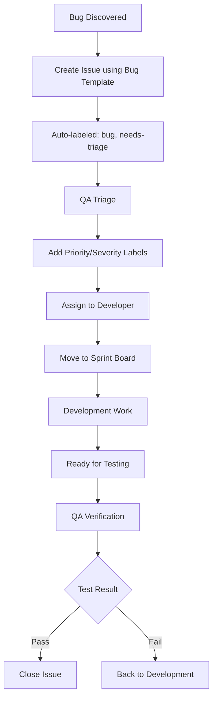
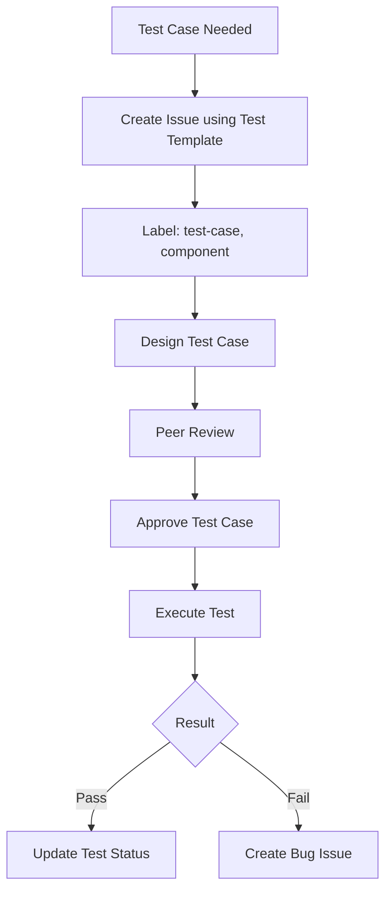

# 🚀 GitHub Issues & Projects for QA Management

## 📋 Complete QA Workflow Setup

This guide shows how to use GitHub Issues and Projects for comprehensive Quality Assurance management in The Cosmic Coffeehouse project.

## 🏷️ Label Strategy

### Bug Labels
```
🐛 bug                    # General bug issues
🔥 critical              # P0 - Critical priority bugs
⚡ high-priority         # P1 - High priority bugs
📋 medium-priority       # P2 - Medium priority bugs
🔧 low-priority          # P3 - Low priority bugs
💥 blocker               # Blocks release/development
🔄 regression            # Previously working feature broken
```

### Component Labels
```
🔐 auth                  # Authentication & user management
🛍️ cart                  # Shopping cart functionality
📦 products              # Product catalog & search
🎨 ui                    # User interface & design
⚡ api                   # Backend API issues
💾 database             # Database related issues
📱 mobile               # Mobile specific issues
🌐 browser-compat       # Cross-browser compatibility
♿ accessibility        # Accessibility compliance
🔒 security             # Security related issues
⚡ performance          # Performance issues
```

### Testing Labels
```
🧪 testing              # General testing issues
📝 test-case            # Test case requests/updates
🤖 automation           # Test automation related
📊 manual-testing       # Manual testing required
🔍 exploratory          # Exploratory testing
📈 performance-test     # Performance testing
🛡️ security-test       # Security testing
♿ accessibility-test   # Accessibility testing
```

### Process Labels
```
🔍 needs-triage         # Requires initial review
✅ ready-for-dev        # Ready for development
🔄 in-progress          # Currently being worked on
⏸️ blocked              # Blocked by dependency
🧪 needs-testing        # Ready for QA testing
📝 needs-documentation  # Requires documentation
✅ qa-approved          # QA sign-off complete
🚀 ready-for-release    # Release ready
```

### Severity Labels
```
🔴 severity-critical    # S1 - System down, data loss
🟠 severity-high        # S2 - Major functionality broken
🟡 severity-medium      # S3 - Feature partially broken
🟢 severity-low         # S4 - Minor issues, cosmetic
```

## 📊 GitHub Projects Setup

### Project 1: "QA Sprint Board"
**Purpose**: Daily QA workflow management

**Columns**:
1. **Backlog** - New issues awaiting triage
2. **Triaged** - Prioritized and assigned
3. **In Development** - Being fixed by developers
4. **Ready for Testing** - Ready for QA verification
5. **Testing** - Currently being tested
6. **Passed** - QA approved
7. **Failed** - Issues found, back to development
8. **Done** - Completed and closed

**Automation Rules**:
- New issues → Backlog
- Issues assigned → Triaged
- PR opened → In Development
- PR merged → Ready for Testing
- Issue closed → Done

### Project 2: "Release Quality Gate"
**Purpose**: Release readiness tracking

**Columns**:
1. **Planned** - Features planned for release
2. **Development** - In active development
3. **Code Review** - Under peer review
4. **QA Testing** - Quality assurance testing
5. **Release Candidate** - Ready for release
6. **Released** - Deployed to production

**Views**:
- **By Priority**: Critical → High → Medium → Low
- **By Component**: Auth, Cart, Products, UI, API
- **By Assignee**: Team member responsibility

### Project 3: "Test Case Management"
**Purpose**: Test case tracking and execution

**Columns**:
1. **Test Design** - Writing test cases
2. **Review** - Peer review of test cases
3. **Approved** - Ready for execution
4. **Executing** - Currently running tests
5. **Passed** - All tests passed
6. **Failed** - Issues found
7. **Blocked** - Cannot execute

## 🔄 QA Workflow Process

### Bug Reporting Workflow


### Test Case Management Workflow


## 📝 Issue Creation Best Practices

### For Bug Reports
1. Use the bug_report.yml template
2. Always include:
   - Clear reproduction steps
   - Expected vs actual behavior
   - Environment details
   - Screenshots/videos if applicable
3. Apply appropriate labels:
   - Component (auth, cart, products, etc.)
   - Priority (P0-P3)
   - Severity (S1-S4)
4. Assign to appropriate developer
5. Add to Sprint Board project

### For Test Cases
1. Use the test_case.yml template
2. Include:
   - Test objective
   - Preconditions
   - Test steps
   - Expected results
   - Automation considerations
3. Labels to add:
   - test-case
   - Component being tested
   - Type of testing (manual, automation, etc.)

### For Feature Requests
1. Use feature_request.yml template
2. Include business justification
3. Add acceptance criteria
4. Consider QA impact
5. Label with enhancement + component

## 🔍 Advanced GitHub Features for QA

### 1. Issue Templates with Required Fields
```yaml
# Example from our bug_report.yml
- type: dropdown
  id: severity
  attributes:
    label: Severity
    options:
      - S1 - Critical
      - S2 - High
      - S3 - Medium
      - S4 - Low
  validations:
    required: true
```

### 2. Automated Label Assignment
```yaml
# .github/labeler.yml (future enhancement)
"auth":
  - "backend/src/routes/auth*"
  - "frontend/src/components/Auth*"

"cart":
  - "backend/src/routes/cart*"
  - "frontend/src/components/Cart*"
```

### 3. Issue Forms Validation
- Required fields prevent incomplete reports
- Dropdowns ensure consistent labeling
- Pre-defined options reduce triage time

## 📊 QA Metrics Dashboard

### Key Metrics to Track
1. **Bug Discovery Rate**: Issues created per week
2. **Resolution Time**: Time from open to close
3. **Reopen Rate**: Percentage of bugs reopened
4. **Test Coverage**: Test cases per feature
5. **Quality Gate Success**: % of releases without critical bugs

### GitHub Insights Usage
- **Issues tab**: Filter by labels for component analysis
- **Projects**: Burndown charts and velocity tracking
- **Pulse**: Activity overview and contributor stats
- **Graphs**: Issue trends and response times

## 🎯 Interview Demonstration Script

### Live Demo Flow:
1. **Show Issue Templates**:
   - Create a sample bug report
   - Demonstrate required fields and validation
   - Show how labels are auto-applied

2. **Project Board Management**:
   - Add issue to Sprint Board
   - Move through workflow columns
   - Show automation in action

3. **Advanced Filtering**:
   - Filter by component: `label:auth`
   - Filter by priority: `label:high-priority`
   - Filter by status: `label:needs-testing`

4. **QA Metrics**:
   - Show issue trends over time
   - Demonstrate label-based reporting
   - Explain quality gate criteria

### Sample Queries for Demo:
```
# All critical bugs
is:issue is:open label:bug label:critical

# Auth component issues needing testing
is:issue label:auth label:needs-testing

# Test cases for shopping cart
is:issue label:test-case label:cart

# Performance issues by priority
is:issue label:performance sort:created-desc
```

## 🛠️ Setup Commands

### Creating Labels (GitHub CLI):
```bash
# Install GitHub CLI first: gh auth login

# Bug Priority Labels
gh label create "critical" --color "B60205" --description "P0 - Critical priority"
gh label create "high-priority" --color "D93F0B" --description "P1 - High priority"
gh label create "medium-priority" --color "FBCA04" --description "P2 - Medium priority"
gh label create "low-priority" --color "0E8A16" --description "P3 - Low priority"

# Component Labels
gh label create "auth" --color "1F77B4" --description "Authentication & user management"
gh label create "cart" --color "FF7F0E" --description "Shopping cart functionality"
gh label create "products" --color "2CA02C" --description "Product catalog & search"

# Testing Labels
gh label create "test-case" --color "8E44AD" --description "Test case requests/updates"
gh label create "automation" --color "3498DB" --description "Test automation related"
gh label create "manual-testing" --color "E74C3C" --description "Manual testing required"
```

### Creating Projects:
1. Go to repository → Projects tab
2. Create "QA Sprint Board" with workflow columns
3. Add automation rules for issue movement
4. Create custom views by priority/component

## 🎓 Benefits for QA Team

### Efficiency Gains:
- **Standardized reporting**: Consistent bug reports
- **Automated workflow**: Issues flow through pipeline
- **Clear visibility**: Everyone knows current status
- **Metrics tracking**: Data-driven quality decisions

### Team Collaboration:
- **Developers**: Clear requirements and repro steps
- **Product**: Priority and business impact visibility
- **QA**: Organized test case management
- **Management**: Progress tracking and quality metrics

### Quality Improvements:
- **Better bug tracking**: Nothing falls through cracks
- **Test case management**: Systematic test coverage
- **Release gates**: Quality criteria before releases
- **Continuous improvement**: Metrics drive process enhancement

---

**This setup transforms GitHub into a comprehensive QA management platform! 🚀**