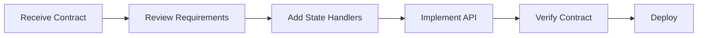
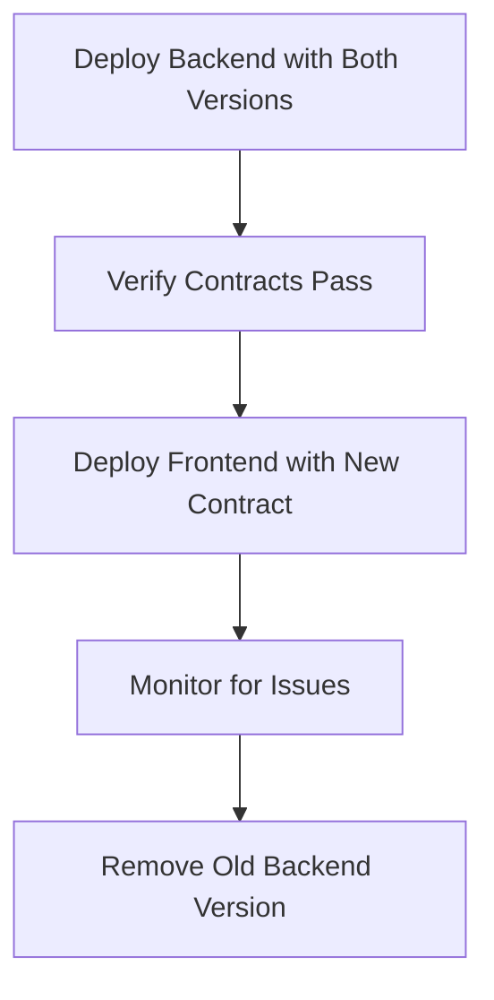

# Contract Testing Team Workflow Guide

## 🎯 Overview

This guide establishes the team workflows for managing API contract testing in The Cosmic Coffeehouse project. It covers processes for new feature development, handling breaking changes, and maintaining contract quality.

## 👥 Team Roles & Responsibilities

### Frontend Team (Consumer)
- **Define API contracts** based on application needs
- **Write consumer tests** that generate pact files
- **Review backend changes** that might affect contracts
- **Update contracts** when UI requirements change

### Backend Team (Provider)
- **Implement APIs** according to consumer contracts
- **Verify contracts** through provider tests
- **Maintain state handlers** for test scenarios
- **Communicate breaking changes** early

### QA Team
- **Monitor contract test results** in CI/CD pipeline
- **Investigate contract failures** and coordinate fixes
- **Maintain contract testing infrastructure**
- **Ensure coverage** of critical API endpoints

### DevOps Team
- **Integrate contract tests** into CI/CD pipelines
- **Manage Pact Broker** (if using centralized contracts)
- **Monitor deployment gates** based on contract verification
- **Maintain testing infrastructure**

## 🔄 Development Workflows

### 1. New Feature Development

#### Phase 1: Contract Definition (Frontend-Led)


**Frontend Developer Steps:**

1. **Analyze Feature Requirements**
   ```bash
   # Create feature branch
   git checkout -b feature/order-tracking
   ```

2. **Define Consumer Contract**
   ```typescript
   // consumer/orders/order-tracking.consumer.pact.test.ts
   describe('Order Tracking Contract', () => {
     it('should get order status', async () => {
       await provider.addInteraction({
         state: 'order exists with tracking info',
         uponReceiving: 'a request for order status',
         withRequest: {
           method: 'GET',
           path: '/api/orders/123/status',
           headers: { 'Authorization': like('Bearer token') }
         },
         willRespondWith: {
           status: 200,
           body: {
             orderId: '123',
             status: like('shipped'),
             trackingNumber: like('TRACK123'),
             estimatedDelivery: iso8601DateTime()
           }
         }
       });
     });
   });
   ```

3. **Run Consumer Tests**
   ```bash
   npm run test:consumer
   # Generates pact file
   ```

4. **Develop Frontend Feature**
   ```typescript
   // Can develop with mock responses immediately
   const orderStatus = await getOrderStatus('123');
   ```

5. **Share Contract**
   ```bash
   # Commit pact file
   git add pacts/
   git commit -m "feat: add order tracking contract"

   # Or publish to broker
   npm run pact:publish
   ```

#### Phase 2: Contract Implementation (Backend-Led)



**Backend Developer Steps:**

1. **Review Contract Requirements**
   ```bash
   # Pull latest contracts
   git pull origin develop

   # Review new pact file
   cat pacts/CosmicCoffeehouse-Frontend-CosmicCoffeehouse-Backend.json
   ```

2. **Add Provider State Handler**
   ```typescript
   // provider/config/pact.provider.config.ts
   stateHandlers: {
     'order exists with tracking info': async () => {
       await Order.create({
         _id: '123',
         status: 'shipped',
         trackingNumber: 'TRACK123',
         estimatedDelivery: new Date(),
         userId: 'user123'
       });
     }
   }
   ```

3. **Implement API Endpoint**
   ```typescript
   // backend/src/routes/orders.ts
   router.get('/:orderId/status', async (req, res) => {
     const order = await Order.findById(req.params.orderId);
     res.json({
       orderId: order._id,
       status: order.status,
       trackingNumber: order.trackingNumber,
       estimatedDelivery: order.estimatedDelivery
     });
   });
   ```

4. **Verify Contract**
   ```bash
   npm run test:provider
   # Must pass before deployment
   ```

### 2. API Changes & Evolution

#### Safe Changes (Non-Breaking)

✅ **Adding Optional Fields**
```typescript
// Backend can safely add optional fields
{
  orderId: '123',
  status: 'shipped',
  newOptionalField: 'additional-data' // ✅ Frontend ignores unknown fields
}
```

✅ **Adding New Endpoints**
```typescript
// New endpoints don't break existing contracts
app.get('/api/orders/:id/details', handler); // ✅ Safe to add
```

✅ **Expanding Enum Values**
```typescript
// Adding new status values
status: 'shipped' | 'delivered' | 'returned' | 'cancelled' // ✅ Safe to add 'cancelled'
```

#### Breaking Changes (Require Coordination)

❌ **Removing Fields**
```json
// Removing required fields breaks contracts
{
  "orderId": "123"
  // "status": "shipped" ❌ Frontend expects this field
}
```

❌ **Changing Field Types**
```json
// Changing types breaks contracts
{
  "orderId": 123, // ❌ Was string, now number
  "status": "shipped"
}
```

❌ **Renaming Fields**
```json
// Field renames break contracts
{
  "order_id": "123", // ❌ Was "orderId"
  "order_status": "shipped" // ❌ Was "status"
}
```

### 3. Breaking Change Workflow

When breaking changes are necessary, follow this coordinated approach:

#### Step 1: Communication (Both Teams)

1. **Backend Team** identifies need for breaking change
2. **Create RFC** (Request for Comments) with:
   - Reason for change
   - Proposed new contract
   - Migration timeline
   - Backward compatibility plan

#### Step 2: Version Strategy (Backend Team)

```typescript
// Option A: API Versioning
app.get('/api/v1/orders/:id', oldHandler);  // Keep old version
app.get('/api/v2/orders/:id', newHandler);  // Add new version

// Option B: Gradual Migration
app.get('/api/orders/:id', (req, res) => {
  const response = {
    orderId: order.id,
    // Support both old and new formats temporarily
    status: order.status,
    order_status: order.status, // Duplicate for migration
  };
  res.json(response);
});
```

#### Step 3: Frontend Migration (Frontend Team)

```typescript
// Update consumer contract for new format
await provider.addInteraction({
  // ... new contract definition
});

// Update application code to handle both formats
const status = response.status || response.order_status;
```

#### Step 4: Coordinated Deployment



## 🚨 Handling Contract Failures

### When Consumer Tests Fail

**Common Causes:**
- Test data setup issues
- Mock configuration problems
- TypeScript compilation errors

**Resolution Process:**
1. **Check test logs** for specific error messages
2. **Verify mock setup** matches expected API calls
3. **Update test data** if business logic changed
4. **Fix TypeScript issues** if present

### When Provider Verification Fails

**Common Causes:**
- Missing state handlers
- API response format mismatch
- Database setup issues
- Authentication problems

**Resolution Process:**

1. **Identify Failure Type**
   ```bash
   # Run with verbose logging
   PACT_LOG_LEVEL=debug npm run test:provider
   ```

2. **Check State Handlers**
   ```typescript
   stateHandlers: {
     'user exists': async () => {
       // Ensure this actually creates the expected user
       const user = await User.create({...});
       console.log('Created user:', user._id);
     }
   }
   ```

3. **Verify Response Format**
   ```typescript
   // Contract expects
   { userId: '123', email: 'test@example.com' }

   // API returns
   { user_id: '123', email: 'test@example.com' }
   // ❌ Field name mismatch - fix API or update contract
   ```

4. **Check Database State**
   ```typescript
   // Add debugging to state handlers
   stateHandlers: {
     'product exists': async () => {
       const product = await Product.create({...});
       console.log('Created product:', product);

       // Verify it was actually created
       const found = await Product.findById(product._id);
       console.log('Found product:', found);
     }
   }
   ```

## 📋 Code Review Process

### Contract Review Checklist

**For Consumer Contracts (Frontend):**
- [ ] Contract reflects actual frontend needs
- [ ] Uses flexible matchers (not hardcoded values)
- [ ] Includes error scenarios
- [ ] State names are descriptive
- [ ] Authentication handled correctly

**For Provider Verification (Backend):**
- [ ] All state handlers implemented
- [ ] State setup creates correct test data
- [ ] Database cleanup between tests
- [ ] Response format matches contract exactly
- [ ] Error responses handled

**For Both Teams:**
- [ ] Contract changes are backward compatible OR properly versioned
- [ ] Breaking changes communicated in advance
- [ ] Documentation updated
- [ ] CI/CD pipeline passes

### Review Questions

1. **Business Logic:** Does the contract accurately represent the business requirements?
2. **Data Format:** Is the request/response structure optimal for the frontend?
3. **Error Handling:** Are error scenarios covered appropriately?
4. **Performance:** Will this contract support the expected load?
5. **Security:** Are authentication and authorization handled correctly?
6. **Future Compatibility:** Will this contract support planned future features?

## 🎯 Quality Metrics & Monitoring

### Contract Coverage Goals
- **Authentication APIs:** 100% (critical for security)
- **Core Business APIs:** 90% (orders, products, cart)
- **Administrative APIs:** 70% (less critical for user experience)
- **Utility APIs:** 50% (health checks, metadata)

### Performance Targets
- **Consumer Tests:** <30 seconds execution
- **Provider Verification:** <2 minutes execution
- **Contract Generation:** <5 seconds per endpoint
- **CI/CD Integration:** <10 minutes total pipeline time

### Success Metrics
- **Zero production API breaks** due to integration issues
- **95%+ contract test pass rate** in CI/CD
- **<24 hour resolution time** for contract failures
- **100% team adoption** for new API development

## 🛠️ Tools & Commands

### Daily Commands
```bash
# Run consumer tests
npm run test:consumer

# Run provider verification
npm run test:provider

# Run complete contract suite
npm run test:contracts

# Check contract coverage
npm run contract:coverage
```

### CI/CD Commands
```bash
# Publish contracts
npm run pact:publish

# Check deployment safety
npm run pact:can-i-deploy

# Verify specific version
npm run pact:verify --version 1.2.3
```

### Debugging Commands
```bash
# Verbose logging
PACT_LOG_LEVEL=debug npm run test:provider

# Generate detailed report
npm run test:contracts -- --verbose --coverage
```

## 📈 Continuous Improvement

### Monthly Review Process
1. **Analyze contract failure patterns**
2. **Review contract coverage gaps**
3. **Update state handlers for new scenarios**
4. **Optimize slow-running tests**
5. **Gather team feedback on process**

### Quarterly Planning
1. **Plan contract testing for upcoming features**
2. **Evaluate new tools and improvements**
3. **Update team training materials**
4. **Review and update this workflow guide**

---

**Remember: Contract testing is a team effort. Success depends on clear communication, shared responsibility, and commitment to the process.** 🤝